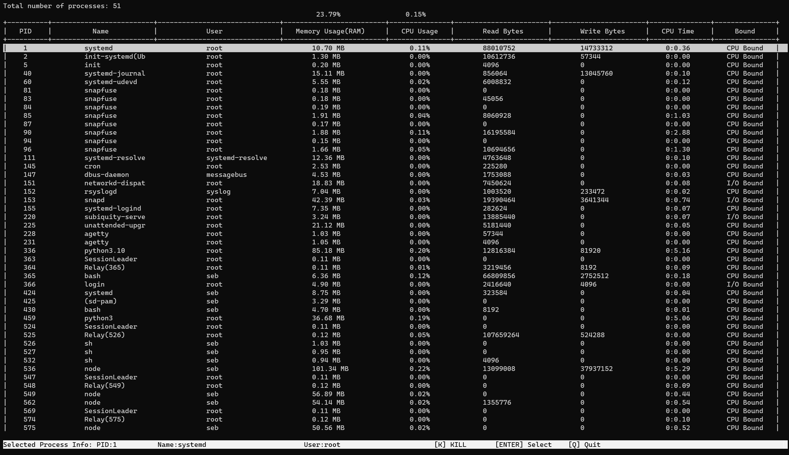

# Process Manager

A Process Manager for Linux written in C++ using ncurses.

## Table of Contents

- [Introduction](#introduction)
- [Screenshots](#screenshots)
- [Features](#features)
- [Installation](#installation)
- [Usage](#usage)

## Introduction

This Process Manager App is a lightweight Linux application that provides a simple interface to manage processes using ncurses. It allows users to view, monitor, and interact with running processes in a terminal-based environment.

## Screenshots

## Features

- Kill processes
- View stats for each process
- View general stats (CPU Usage / Memory Usage)
- Classify Process as CPU/IO Bound

## Installation

1. Before using the process manager, make sure to install the required dependencies: `make install-dependencies`

2. After installing the dependencies, compile the process manager: `make`

## Usage
To run the process manager, execute the following command: `./process_manager`
